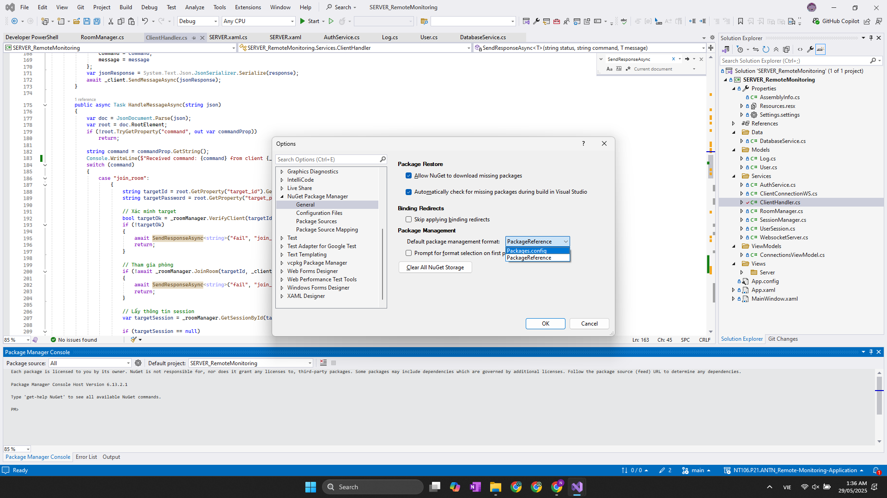

### Remote Monitoring Application
- Build : WPF C#

### Client
#### Tab Home:
> Thông tin user: tên user,...
> Client bị theo dõi sẽ tạo room --> ID, password của room (hiện lên trên giao diện của partner)

#### Tab Remote:
> System info
> Video màn hình trong x phút/ giây
> Process List
> Process Dump (chọn 1 PID trong process list)
> Info : CPU, Disk, Network (Chart)
> (Get file)

### Server
- Dashboard (Tab Home): Hiển thị thông tin tổng quát như số lượng client đang online, logs, cảnh báo gần đây,...

- Users Control:
> Danh sách người dùng/client
> Status
> Time kết nối
> Cho phép server ngắt kết nối

- Connections:
> Hiển thị trạng thái kết nối theo thời gian thực
> Thông tin IP, thời gian kết nối, phiên bản app,...

- Logs & History:
> Nhật ký hoạt động của client
> Ghi nhận thời gian, thao tác, kết quả,...

- Settings:

> Cấu hình server
> (Quản lý API key, giới hạn truy cập, cập nhật)

### Chỉnh không mở terminal console log khi chạy
